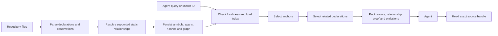

# Loci as a precise code-context tool

Review date: 29 September 2026. Source revision:
`9655a287ca28d758a8848b6622887c54f8f81a41`.
Manifest: `obj_5bbf3d9c02b6a07ff1a30fd389894ecd`, W1.1.

Vik's criterion: **smallest useful trustworthy code context is primary**.
Scope: current normal retrieval path, graph selection/traversal, architectural
weight, retained value evidence, and a bounded comparison with Ember. This is
a review and walkthrough; remediation and feature retirement are proposals.

The source-evidence foundation is useful. The current request path has concrete
discovery and traversal defects, and exact reading pays unnecessary semantic
graph costs. Selection also reserves very small source previews while filling
the response with graph context whose task relevance is uncertain. These are
specific reasons to simplify the product. They do not establish that every
resolver, graph relationship, or safety check is unnecessary.

## Findings

### 1. Required: a weak metadata match suppresses an exact source-text match

At [retrieval.py:910](../../src/loci/retrieval.py#L910), any selected metadata
anchor returns immediately. Literal source lookup at line 924 runs only when
metadata selection returns nothing.

An isolated two-file repository reproduces the consequence:

```python
# handler.py
def execute():
    raise ValueError("connection reset §42§")

# connection.py
def connection():
    return "unrelated"
```

| Query | Actual anchor | Matching | Files searched for literal text |
| --- | --- | --- | ---: |
| `connection reset §42§` | `connection.py::connection#function` | symbol metadata | 0 |
| `§42§` | `handler.py::execute#function` | source literal | 2 |

The full exact error text returns unrelated code, with no omissions in that
packet. Removing informative words finds the correct function. This is a
selection failure before graph traversal begins.

Smallest remedy: prevent weak partial metadata matches from excluding stronger
exact source matches. Keep bounded lookup and explicit uncertainty; no new
search service is needed to address this reproducer.

### 2. Required: failed traversal admission suppresses a later valid path

At [retrieval.py:426](../../src/loci/retrieval.py#L426), unavailable proof adds
the target to `visited`. The target is also marked visited before `packer.add`
returns success at lines 438–440. Later attempts use `include_item=False` for
that target and do not put it on the expansion frontier at lines 447–450.

A controlled probe uses the real traversal and packer with default budgets and
a source provider whose first edge has unavailable proof:

| Available edges from A to B | Source items | Accepted relation | Next expansion | Evidence / output bytes |
| --- | --- | --- | --- | --- |
| Unprovable call, then proven reference | A | Reference to B | None | 10 / 2,860 |
| Proven reference alone | A, B | Reference to B | B | 23 / 3,630 |

Both are far below the 8,192 evidence-byte and 16,384 output-byte limits. The
failed path prevents source and expansion that fit when the valid path is
considered alone. This is an admission-state defect, not an unavoidable budget
omission. The probe injects proof availability at the source seam; it establishes
control flow, not the frequency of this situation in real repositories.

Smallest remedy: distinguish an examined target from a successfully admitted
target. A failed proof or packet addition must not suppress a later admissible
source item and expansion. Preserve bounded examination work and cycle handling.

An earlier probe with `max_items=1` showed the state inconsistency but could not
prove useful source was lost within the available budget. It was superseded by
the default-budget counterfactual above.

### 3. Material performance finding: exact reads reconstruct the entire graph

[service.read:1237](../../src/loci/service.py#L1237) invokes
`_load_graph_context`, which deserializes and validates all graph records through
[IndexStore.validate_graph_state](../../src/loci/storage/index_store.py#L365).
This happens even with `ensure_fresh=False`, for an already issued source handle.

Reading the 5,595-byte `retrieve_context` function in this checkout took **5.597
seconds** in one unprofiled local call, with freshness scanning disabled. A
separate cProfile run took 13.798 seconds, including 12.563 seconds in graph
validation. It reconstructed 52,203 call records and 21,092 reference records.
Profiler overhead makes those timings unsuitable as ordinary latency estimates;
the profile establishes cost attribution. These are individual observations,
not benchmark medians or a universal latency claim.

Smallest useful direction: make exact source expansion depend on the contained
file, current hash, authorized extent and relevant resolver controls. Reuse
validated snapshot state where needed rather than reconstructing every semantic
record for every source page. Preserve freshness, path containment, UTF-8
boundaries and stale-handle refusal.

## The core, walked end to end



| Module | Job | Judgment |
| --- | --- | --- |
| `parser/` | Find declarations, exact source spans, imports, calls and authored types. | Core. |
| Language resolvers in `graph/` | Determine which static bindings are justified; retain unsupported and ambiguous observations. | Core where supported languages earn their use. Much graph complexity is resolution, not walking edges. |
| `storage/`, indexing and freshness in `service.py` | Persist/reconcile source and relationship evidence. | Keep integrity; simplify repeated work in request paths. |
| `graph/anchors.py`, `_select_anchors` | Choose starting declarations from IDs, paths, metadata or literal text. | High-priority repair; downstream traversal cannot rescue an irrelevant starting set reliably. |
| `retrieval.py` | Choose incoming/outgoing context under one fixed policy. | Useful capability; admission bug and relevance policy need attention. |
| `_retrieval_source.py`, `_retrieval_output.py` | Assemble proof and fit complete additions into bounded responses. | Keep truth and budgets; reconsider how the budget is spent. |
| `retrieval_io.py`, `storage/source_refs.py` | Expand exact source with hashes, containment and continuation. | Essential scalpel behavior; remove unrelated graph reconstruction costs. |
| `mcp_server.py` | Expose `loci_retrieve` and `loci_read` normally; separate diagnostic catalog. | The normal two-tool interface is already small. |

Normal traversal is not a plain neighborhood dump. It admits known native
relationship families, makes adjacency in both directions, preserves each
stored edge's direction, and records forward/reverse traversal separately.
It prioritizes selected signature/type paths, then interleaves calls, types,
value references and imports across directions and anchors. Ownership expansion
can lift a declaration to its file and choose representative members without
spending a semantic hop. Defaults cap traversal at two semantic hops, 64 examined
nodes, 32 neighbors per expansion and 12 source items.

That policy is deterministic and bounded. It does not establish that each
selected neighbor helps the task. Family/direction fairness and representative
file members can spend scarce space on incidental relationships.

## Live observations about relevance and response weight

These installed MCP calls preceded creation of this report:

| Request | Observed selection | Unique evidence bytes | Complete output bytes |
| --- | --- | ---: | ---: |
| `normal graph retrieval policy anchors traversal source context` | Three documentation anchors, including archived benchmark instructions; zero relationships. | 2,917 | 8,116 |
| `src/loci/service.py` | First 1,006 bytes of the file, three store-health constants as related items, ten relationships. | 2,172 | 16,207 |
| `retrieve_context` | Correct function, `service.retrieve`, and a scratch validation constant as anchors; three related declarations. | 4,268 | 15,646 |
| Read returned `retrieve_context` source handle | Complete function, lines 83–221. | 5,595 | 6,249 |

All retrievals reported partial results. The exact-file packet reported 72
output-budget omissions; the symbol packet reported 90. These omission counts
are attempts/reasons, not counts of unique missing useful declarations.

[The fixed limits](../../src/loci/_retrieval_output.py#L17) reserve only 1,024
bytes per anchor and 768 per related source preview. The rest of a packet can
contain identity, relationship and evidence framing. Output bytes and unique
source bytes measure different things; their difference is not all removable
waste. Still, the exact-file example demonstrates that a full packet can deliver
little of the requested implementation. The natural-language example is one
observed miss, not a measured search failure rate.

Recommendation: make useful target source the first allocation priority, then
add related declarations with a concrete contextual purpose. Retain proof for
relationships that are actually included. Increasing traversal breadth alone
would not address these examples.

## Keep, simplify and consider retiring

**Keep:** exact source extraction, hash-bound continuation, deterministic limits,
explicit omissions, static edge provenance, refusal to invent dynamic dispatch,
and a small normal interface. The basic representation and adjacency direction
are coherent. This review did not establish a need for a new graph database or
a wholesale resolver rewrite.

**Simplify first:** metadata/literal selection, traversal admission state, exact
reading, and response allocation. These directly affect the user's requested
context and have concrete evidence above.

**Consider retiring after a consumer decision:** overlapping diagnostic search,
exploration and graph retrieval interfaces; general graph profiles and external
contributions. They are documented capabilities with callers/tests, so local
nonuse is insufficient proof that deletion is safe. Normal traversal filters
to `namespace == "loci"` at [retrieval.py:843](../../src/loci/retrieval.py#L843),
while extensions still participate in indexing/freshness and Markdown metadata.
Their ongoing value to code context deserves an explicit product decision.

Removing the diagnostic interface would not make `exploration.py` wholly dead:
[normal proof assembly imports its helpers](../../src/loci/_retrieval_source.py#L10),
and normal output/read code shares `_exploration_output.py`. Preserve or relocate
the shared evidence machinery before retiring an interface. No safe blanket
deletion was established.

For scale only, the reviewer counted 46,859 Python source lines, including
23,012 in `graph/` and 9,652 in `parser/`. These counts do not identify bloat by
themselves, and traversal is only part of `graph/`.

## What Ember does and does not tell us

Ember's [lookup](../../../phluxxed/ember/src/ember/lookup.py) takes exact node
IDs and returns incident edges and endpoints, with three roots and 32 nodes as
limits. Its graph stores Work, Evals, artifacts and related workflow state.
Its execution path compiles Work/Eval context. Loci derives its relationships
from source and must handle lexical scope, imports, ambiguity and proof.

The useful lesson is to give traversal a narrow contextual job. Ember's short
neighborhood walker does not replace source extraction or language resolution.
This was a bounded purpose/traversal comparison, not a review of Ember quality.

## What prior evidence supports

The [15 September activation check](2026-09-15-workflow-host-activation.md)
demonstrates actual host delivery of a function-to-options-to-binding path and
exact source continuation. The most recent retained
[two-task binding comparison](2026-09-15-schema-repair-token-result.md) delivered
required relationship proof to both agents but neither answer contained every
required fact. Median gross input was 1.5325 times its baseline, largely cached
input; elapsed time and visible output passed their gates. This does not isolate
graph causality or describe billed cost.

Earlier [ordinary](2026-09-14-normal-graph-adoption-result.md) and
[multilingual](2026-09-13-multilingual-workflow-measurement.md) comparisons also
did not establish general programming-task efficiency. Those are frozen older
engines, not current-source scores. The later Objective explicitly accepted
ordinary dogfooding; its planned complete-work campaign was discontinued unrun,
not passed. Preserve both the acceptance and the inconclusive value evidence.

## Graph utility and visual follow-up

Vik asked whether traversal itself earns its complexity. The follow-up provides
an [interactive snapshot](../../../loci-review/2026-09-29/loci-graph.html), with
a complete symbol-level repository graph, selectable one/two-hop neighborhoods and the actual
normal MCP packets for `read`, `retrieve_context` and `parse_file`. Supporting
data and source are in `~/loci-review/2026-09-29/`. Snapshot:
`cef99ed675cb14aae776e37dd8aabe6e26053881856f156d60e91146faafcc46`.
It contains 8,927 symbols and 20,629 edges across the indexed repository;
production source contains 2,154 symbols and 6,055 internal edges. Earlier totals
in the turn preceded refresh to include the first review report.

Vik rejected the first visual's formatting and directed using Ember's frontend
as the gold standard. A second version adopted Ember's React Flow/ELK canvas,
dark console styling, fixed inspector and source cards, but its Repository tab
still showed nine aggregate groups. Vik correctly identified that this hid the
actual graph. Both versions are superseded by the linked artifact.

Repository now opens with every one of the 8,927 indexed symbols and all 20,629
stored edge records. There are no synthetic group vertices or node display cap.
Parallel records between the same ordered endpoints share 17,211 connectors;
the inspector retains each record. Explicit scope filters cover all symbols,
production, tests, documentation and benchmarks/scratch; family toggles control
the included edges. Production scope shows 2,154 symbols and 6,055 edge records.
Search locates and zooms to the actual symbol without leaving Repository,
automatically widening scope when required. Zoomed-out marks expand into source
cards as the view approaches readable scale. Connections remain visible across
zoom levels.

Offline positions arrange actual symbols in file-local grids. File regions are
layout units only: only connectors assert relationships. All positions are
finite and the 280×142 cards do not overlap. The layout is intentionally fixed
when filters change. Explore retains its declared 24-node cap; Retrieved context
preserves the actual packet and uses layered ELK routes. The export's frozen
snapshot matches all three packets. For 1,907 stored edges this export could not
validate source excerpts against cached whole-file bytes; those edges remain
visible with an explicit unavailable-excerpt notice. This is not a conclusion
that the underlying relationships are invalid.

The standalone offline artifact passes the TypeScript/Vite build. Agent Eyes
checks verified all 8,927 actual nodes and 17,211 connectors in the Repository
canvas, zero group nodes, production/family filtering, source search, crossing a
scope boundary, following a relationship, and edge-evidence inspection. The
retained `parse_file` packet settles at five nodes, five records and four
connectors. Desktop (1,440px) and mobile (360px) checks show no page overflow.
An observed automatic-fit/search race was corrected and checked again. Current
validation is `~/loci-review/2026-09-29/full-graph-validation.json`; prior visual
receipts remain historical. Screenshot: `full-repository-preview.png`.

| Seed-only request | Useful addition beyond reading the root | Incidental selection or limitation |
| --- | --- | --- |
| `service.read` | Exact call target `retrieval_io.read_source` identifies the cross-file validation owner. | Its preview stops before most safeguards; reverse test callers and duplicate call/reference records consume context. |
| `parse_file` | `_disambiguate` delivers the complete nine-line duplicate-ID suffix rule. | Other selected types, constants and a reverse test caller do not explain that rule. |
| `retrieve_context` | `_count_unresolved` adds omission-classification detail. | Several directly called traversal helpers are absent; a secondary `GraphIndexState → LoadedGraphProfile` type path and a test caller are included. |

These were exact-seed requests with no question text supplied to the tool. The
questions in the visual are review criteria, not prompts falsely attributed to
the requests. Results establish navigation value and selection behavior, not
measured task time/token savings or failure of all possible queries.

The source graph around `parse_file` has eight outgoing targets and 88 incoming
sources, of which 87 are tests. Both-direction expansion therefore has a very
different contextual job from retrieving the function's implementation helpers.
This supports narrowing default traversal: prioritize direct context; make
incoming callers/tests and deeper paths serve an explicit task need; collapse
duplicate call/reference evidence in delivery. Keep validated relationships and
provenance. General profiles and overlapping graph interfaces remain conditional
scope-cut candidates, not proven safe deletions. No production code was changed.

## Concrete reduction proposal after the walkthrough

29 September follow-up, Manifest W1.3. This is a proposed implementation order,
not an implemented change or a decision to remove every graph capability.
`work/upcoming-task` at `b4b55a3` is the direct parent of reviewed `master`
`9655a28`; product source, tests and dependency manifests are identical between
those refs. Its enrichment work is already included in this assessment.

### Target interface

Keep the existing two normal operations and make their jobs precise:

| Operation | Proposed normal behavior |
| --- | --- |
| `loci_retrieve(repo, query/seed_ids)` | Locate bounded source candidates and return useful target source immediately. Preserve ambiguity and coverage. Explicit IDs and exact paths remain direct choices. Exact source text must compete with weak metadata matches; a literal result must show the matching span. Return a complete selected definition when it fits the existing overall budget, otherwise an honest excerpt and exact continuation. |
| `loci_read(repo, source_ref)` | Expand the named source extent with current file/hash/eligibility checks, bounded output and reliable continuation. Ordinary indexed source must not require reconstructing unrelated semantic graph records. |

This keeps useful source inline rather than requiring a new search-only round
trip for every question. It removes automatic callers, tests, type chains and
representative file members from normal retrieval. It does not classify tests
or documentation as globally unwanted: an explicit request can select either.
Relationships remain non-exhaustive whenever a retained operation returns them.

A public relationship-follow operation is a separate product decision. The
current normal host exposes only these two tools; explicit relationship queries
exist in the operator-selected diagnostic catalog, not as an immediately
available normal-agent fallback. Adding a third tool or restoring the diagnostic
catalog is not required for the first slice.

### Reuse and cut map

| Existing implementation | Proposed treatment and dependency |
| --- | --- |
| Declaration parsing, symbol identities/spans, repository inventory and cached source | Keep as the source-context foundation. Keep supported-language and coverage limits explicit. |
| `_select_anchors` / `_literal_anchors` | Repair precedence and retain literal match offsets. At present metadata wins before source lookup, and byte `offset` is discarded when creating `_SelectedAnchor` (`retrieval.py:884–1025`). This latter observation is a source-backed implication, not an additional runtime reproducer. |
| `_anchor_addition` and `RetrievalPacker` | Reuse exact extents, atomic budget admission and output accounting. Replace the fixed 1,024-byte anchor allocation with target-source-first allocation under the existing total cap. Long matches need a matching excerpt, not merely a larger prefix (`retrieval.py:748–771`). |
| Existing `graph_enrichment=False` seam | Reuse to demonstrate the desired selection behavior. It returns after anchor packing, before adjacency, semantic traversal and ownership expansion (`retrieval.py:101–115`). It is an internal process control, not a proposed permanent user-facing mode. |
| Normal traversal fairness, type bridges, ownership/member lifts, multi-hop queue | Remove from normal retrieval. Retire their implementation and old default-packet expectations once the new contract is verified and their remaining evaluation consumers are handled. This avoids spending the first change repairing a policy proposed for retirement. |
| `RetrievalSource` eager proof indexes | Build only for retained relationship operations. Its constructor currently calls `_records` and `_index_imports` even with enrichment off (`_retrieval_source.py:64–86`). Source hydration and graph proof should have independent requirements. |
| Exact-source handles, containment, hashes, UTF-8 bounds, pagination, stale/unknown-handle refusal | Keep. Removing graph validation also removes some incidental validation of index metadata; validate the required source metadata explicitly, failing closed on malformed hashes or shapes. |
| Graph load/freshness/index construction | Separate from ordinary source needs. `_load_graph_context`, `_current_index_staleness_reasons` and `_index_repo_unlocked` currently make graph validation/materialization part of the shared path (`service.py:167`, `:2020`, `:2195`). Skipping traversal does not skip these costs. |
| Language relationship resolvers, profiles/extensions and diagnostic graph interfaces | No blanket deletion is established. They have current callers and shared helpers. Decide which explicit relationship capability is wanted before retiring its producer, schema or interface. General graph profiles/extensions are candidates, not prerequisites for a useful first delivery. |

### Implementation order and focused acceptance

1. **Make a normal retrieval useful on its own.** Use the existing anchor-only
   route; correct exact-literal versus metadata selection; retain match positions;
   allocate the packet to selected source before any incidental context. Update
   the declared policy/output contract and normal-tool instructions together.
   Acceptance: the existing `connection reset §42§` reproducer selects `execute`;
   a match late in a long definition is visible in the returned excerpt; a
   selected definition that fits is complete; exact paths/IDs, ambiguous results,
   bounds and continuation still work. Related tests already live in
   `tests/test_retrieval_enrichment.py`, `tests/test_retrieval.py` and
   `tests/test_normal_retrieval_acceptance.py`; default graph fingerprints should
   change deliberately with the product behavior.

2. **Make source retrieval and reading independent of semantic graph work.**
   Load validated source metadata once and reuse it. Ordinary reads need the
   source-reference payload, indexed file hash/eligibility and current contained
   file bytes. `read_source` does not use its `nodes` argument; `state` supplies
   resolver-control eligibility and hashes (`retrieval_io.py:107–144`). A small
   intermediate improvement can validate graph state only for control handles,
   preserving their current checks. However, that alone does not complete this
   slice: normal MCP calls use `ensure_fresh=True`, whose shared freshness path
   still validates or refreshes the graph, and `IndexStore.load` parses the whole
   JSON index. Source freshness must remain correct while becoming independent
   of graph health/resolution. Preserve the strict control-handle route until its
   own requirements are isolated. Acceptance must exercise the **normal host
   path with freshness enabled**, plus stale/deleted/escaped files, malformed
   source metadata, UTF-8 boundaries, cross-repository/unknown handles and a
   resolver-control handle. An `ensure_fresh=False` microcheck cannot establish
   success for the host path. Reuse `test_normal_source_refs.py`,
   `test_retrieval_io.py` and `test_source_ref_store.py`; add a directly relevant
   control-handle service check if that route changes. Measure this checkout's
   exact read again without claiming the earlier single timing is a baseline
   distribution. Physical storage splitting is a later choice if whole-index
   parsing remains material; do not introduce a second cache pre-emptively.

3. **Delete the retired normal policy and close its consumers.** Remove automatic
   expansion machinery that no longer has a retained purpose, update policy-bound
   tests, schemas, normal MCP descriptions, README and repository/installed Loci
   operating instructions. Preserve frozen historical benchmark results; do not
   reinterpret them as scores for the replacement. The old policy has internal
   evaluation bindings, so its removal includes an explicit decision about those
   callers. Resolver/profile retirement remains a separate scope decision. Do
   not delete `exploration.py` or `_exploration_output.py` while source/proof code
   still imports their helpers.

The first deliverable is slice 1: a source-first normal retrieval contract with
the matching and excerpt defects addressed. Slice 2 supplies the runtime
decoupling; neither a flag flip nor fewer returned edges proves it complete.
Compare a handful of the existing real navigation cases for required source,
irrelevant source, follow-up reads and latency. No provider campaign or general
claim of agent task-efficiency is needed to verify the specific behavior.

Planning verification: the primary inspected the current retrieval, source-read,
index-construction, freshness and MCP paths. Two bounded Sol/high reviewers
independently traced retrieval selection/packing and exact-source dependencies;
their conclusions were adopted with the explicit freshness/storage qualification
above. No product code changed and no new test run was needed for this proposal.

## Verification and limits

### Accepted reduction implementation

30 September: Vik accepted the isolated worktree and directed “Crack on then
pleawse”. Implementation is on `refactor/source-first-context` in
`/Users/brummerv/phluxxed/loci-scalpel`; the installed original checkout remains
on master. Manifest W2.1–W2.3 track source selection, independent source freshness
and read, and retirement of automatic traversal with its current consumers.

Delegation record (primary owns design, integration and verification):

- `source_selection`, Sol/high/fork none: bounded implementation in anchor
  selection/packing, retrieval output budget admission and focused selection
  tests. Acceptance: exact error text beats weak metadata, late literal visible,
  complete fitting definitions, bounded exact continuation. No service/schema
  or documentation edits, installs or commits.
- `source_freshness`, Sol/high/fork none: read-only service/storage/read tracing.
  Returned split reusing source inventory/parser, with explicit graph invalidation
  and full reparse on subsequent graph rebuild. Adopted; primary implements.
  Source-only writes must rebuild file identities and preserve control handles
  through conditional graph authorization. No tests or code changed by worker.
- `source_docs`, Sol/high/fork none: repository README and Loci skill
  instructions/references, normal MCP descriptions only. Acceptance: existing
  two operations describe source selection, exact continuation, graph independence
  and diagnostic graph limitations consistently. Update development skill source;
  installed skill remains paired with production until rollout. No product logic,
  schemas, tests, installations or host registration edits.
  Returned edits in README, the skill and four references plus normal MCP
  descriptions; adopted after primary comparison with the implemented contract.

All workers complete directly without child agents. Tree/capacity checked before
launch; no running work displaced. Verification uses the development `src` first
on the interpreter path and a dedicated store, because the existing store maps
Git worktrees to their primary repository identity.

Required W2.2 verification delegation: reuse `source_freshness` (retained
service/storage/control-read context, same Sol/high/fork none) for
`tests/test_source_context.py` only. Verify freshness-enabled normal MCP first
use and refresh without graph validation/materialization, unrelated graph
corruption, complete later graph rebuild, malformed source metadata rejection
and resolver-control authorization. These checks close the accepted runtime and
integrity requirements; prior read/selection tests alone do not exercise them.
No product edits or broader test campaign.

Delivered W2.1–W2.3:

- `source-context-v1` retains retrieve/read names and bounded packet/source-ref
  mechanics. Exact names select exact candidates; exact literals outrank weak
  metadata, and clipping preserves their match span. Complete selected definitions
  are admitted when they fit; oversized selections share the source budget.
- Removed automatic calls/type/import/value traversal, family rounds, type
  bridges, member/owner expansion, proof-index assembly and `RetrievalRuntime`.
  Kept indexed file membership, source hashes, containment, UTF-8 boundaries,
  continuation, ambiguity and coverage. Compatibility relationship fields are
  empty/zero with an explicit `not_selected` scope.
- Normal freshness indexes declarations and source inventory independently of
  graph resolver state. Source refresh invalidates graph state; a later explicit
  graph refresh rebuilds it. Ordinary reads reuse validated source metadata;
  resolver-control reads still require validated graph authorization.
- Removed retired policy tests and current graph-on/off execution bindings;
  legacy experiment startup/preparation rejects the new policy. Historical
  receipts/evaluation stay readable. The normal-capture adapter accepts source
  packets with no relationships while retaining legacy interpretation.
- Updated repository instructions and MCP descriptions. Production installation
  and its installed instructions stay paired with the original checkout until
  rollout; no host repoint, dependency install, merge or deployment occurred.

Focused final verification (development `src` selected explicitly):

```sh
PYTHONPATH=/Users/brummerv/phluxxed/loci-scalpel/src /Users/brummerv/loci/.venv/bin/python -m pytest -q tests/test_source_context.py tests/test_retrieval.py tests/test_normal_retrieval_acceptance.py tests/test_normal_source_refs.py tests/test_retrieval_io.py tests/test_source_ref_store.py tests/test_normal_mcp.py tests/test_complete_work_control.py tests/test_ordinary_adoption_normal.py
```

Result before the final joint-budget correction: **86 passed in 4.21 seconds**.
The source-freshness worker's new 10-case
check also passed independently. Primary modified the source-selection result
to exclude weak matches alongside exact names and enforce fair oversized source
shares; its initial 22 tests were before automatic-policy retirement, and the
final integrated checks above verify the delivered behavior. The first integrated
run exposed the exact-name weak-match defect; the corrected case passes.

A concrete remaining allocation case used three Markdown anchors containing
JSON-escaped control characters. Sequential admission exhausted the output budget
on the first excerpt, although useful excerpts for all three would fit. The
primary fixed the shared cause: reserve selected identities first, try all full
definitions as one packet, then clip source jointly under the output/evidence
budgets. A regression also checks overlapping class/method extents stay complete
when their actual joint packet fits. This supersedes the earlier sequential
allocation implementation. After that correction, the directly affected
retrieval/acceptance/source-ref/read/MCP/freshness suite passed **62 tests in
3.85 seconds**, including both new cases. Other consumer/ref-store checks passed
in the 86-test run; no optional campaign was added.

A bounded real-checkout smoke used a dedicated temporary store and forbade
graph validation, materialization and relationship extraction throughout:

| Exact request | Selected items | Target complete | Source bytes | Whole result bytes | Fresh exact read, single sample |
| --- | ---: | --- | ---: | ---: | ---: |
| `parse_file` | 1 | yes | 1,483 | 3,693 | 803 ms |
| `service.read` | 1 | yes | 523 | 2,567 | 813 ms |
| `retrieve_context` | 1 | yes | 581 | 2,702 | 796 ms |

All three returned no selection omissions, partial repository coverage and zero
relationships. Exact reads matched inline source. The first source retrieval,
including initial index construction, took 2.80 seconds; the following two took
0.78/0.84 seconds. These are local single observations, not a benchmark
distribution or an agent-efficiency claim. The earlier 5.597-second read used a
different source extent and is not a matched speedup baseline. Repository-wide
source freshness scanning and whole-index JSON parsing remain. Language graph
resolvers, profiles and diagnostic interfaces are retained for explicit use.

Primary reviewed the integrated diff and consumer changes. No full suite or
provider campaign was required or run. Production master and its launcher were
checked separately for isolation. Final Objective acceptance remains Vik's.

For the initial review, the graph reviewer ran:

```sh
.venv/bin/pytest -q tests/test_retrieval.py tests/test_retrieval_enrichment.py tests/test_normal_retrieval_acceptance.py
```

Result: **50 passed in 2.54 seconds**. Existing checks establish selected proof,
source integrity, deterministic behavior, omissions and budgets. They missed
the failed-admission counterfactual and do not establish minimal relevant context
or improved complete-work outcomes. Primary verification comprised the live
MCP calls, isolated literal-search reproducer, source tracing and timed/profiled
exact read. No full suite or new model campaign was run.

Correctness, readability, architecture and performance were assessed on this
path. Source containment/hash checking was inspected for security; this was not
a comprehensive security audit or exhaustive review of every language resolver.
The initial review changed no product source; only review artifacts and Manifest
were added then. The subsequently authorized implementation is recorded above.

## Reproduce the two selection/admission failures

From the repository root, run the following with `.venv/bin/python`. The first
part creates and removes its own temporary repository/store. The second injects
proof availability at the source seam while using the real traversal and packer.

```python
import hashlib
import os
import tempfile
from pathlib import Path

with tempfile.TemporaryDirectory(prefix="loci-review-") as directory:
    root = Path(directory)
    repo = root / "repo"
    repo.mkdir()
    os.environ["LOCI_BASE_DIR"] = str(root / "store")
    os.environ["LOCI_STORE_NAMESPACE"] = "review"
    (repo / "handler.py").write_text(
        'def execute():\n    raise ValueError("connection reset §42§")\n'
    )
    (repo / "connection.py").write_text(
        'def connection():\n    return "unrelated"\n'
    )
    from loci import service
    service.index_repo(repo)
    for query in ("connection reset §42§", "§42§"):
        result = service.retrieve(repo, query)
        print(query, result["scope"]["matching"],
              [a["node_id"] for a in result["anchors"]])

from loci._exploration_output import Span
from loci._retrieval_output import Addition, ItemInput, RetrievalPacker
from loci.graph.contracts import GraphEdge, GraphEvidence
from loci.graph.traversal import graph_adjacency
from loci.retrieval import _Visit, _traverse_relationships

def span(file, content):
    raw = content.encode()
    return Span(file, 0, len(raw), 1, 1,
                hashlib.sha256(raw).hexdigest(), content)

anchor = {"id": "a", "name": "a", "kind": "function",
          "file_path": "a.py", "byte_length": 7}
target = {"id": "b", "name": "b", "kind": "function",
          "file_path": "b.py", "byte_length": 13}
nodes = {"a": anchor, "b": target}
site = span("a.py", "b()")
body = span("b.py", "def b(): pass")
anchor_span = span("a.py", "def a()")

class Source:
    def proof(self, edge):
        return None if edge.type == "calls" else (site,)
    def definition(self, node):
        return body
    def file_owner(self, node):
        return None
    def resolution_configuration(self, edge):
        return None

edges = [GraphEdge("a", "b", kind, True, "loci", "exact",
                   GraphEvidence("a.py", 1, site.content_hash))
         for kind in ("calls", "references")]

def run(selected_edges):
    packer = RetrievalPacker(
        Path("/tmp"), snapshot="s",
        selection={"mode": "explicit", "candidate_count": 1,
                   "omitted_candidates": 0},
        scope={"source": "indexed_supported_source", "coverage": "complete",
               "matching": "explicit_ids",
               "relationships": "known_static_relationships", "exhaustive": False},
        anchors=[{"node_id": "a", "score": 0,
                  "matched_terms": [], "match_scope": []}],
    )
    assert packer.add(Addition(
        nodes=(anchor,), items=(ItemInput(anchor, "anchor", 0, "anchor",
                                         anchor_span, anchor_span, True),)))
    next_visits = _traverse_relationships(
        [_Visit("a", 0, 0, (), "anchor")], depth=0, source=Source(),
        nodes=nodes, adjacency=graph_adjacency(selected_edges, direction="either"),
        query_terms=set(), degrees={"a": 2, "b": 2}, packer=packer, visited={"a"},
    )
    packet = packer.finish()
    return {"items": [item["node_id"] for item in packet["items"]],
            "next_visits": [visit.node_id for visit in next_visits],
            "omissions": packet["omissions"], "usage": packet["usage"]}

print("both edges:", run(edges))
print("valid edge only:", run(edges[1:]))
```
